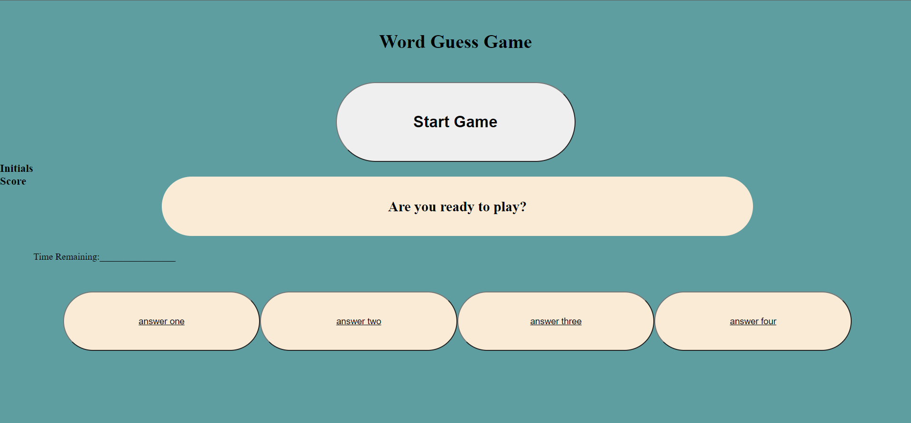

# Quiz-Mania

This project is supposed to provide a question and answers that function in a guessing game. 

I learned about functions, for loops, constants and variables, if statements, fringe conditons and basic javasript syntax

## Installation 

None required. Simple website. 

## Usage

fun question quiz that can be updated as a flash card system to further my learning. 

## Mock up 

https://remotemana.github.io/Quiz-Mania/